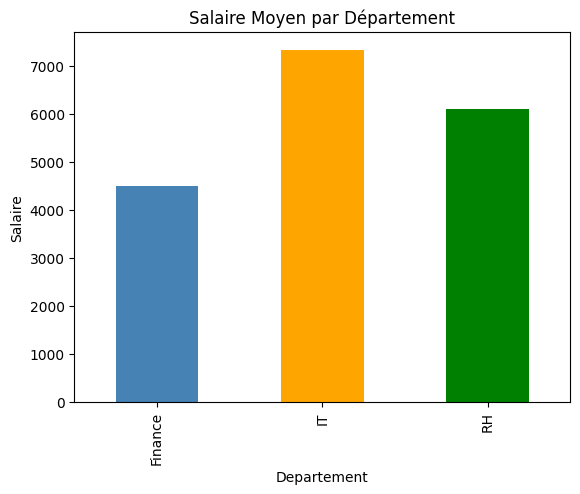
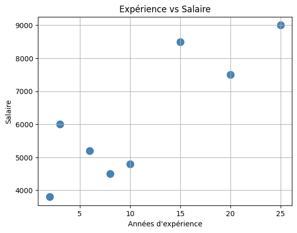
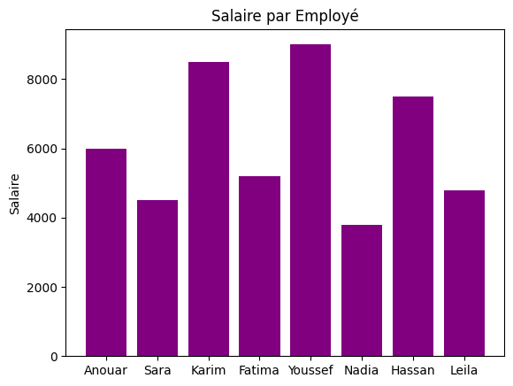

# 💼 Analyse des Salaires

Analyse exploratoire des salaires des employés par département et expérience.

## 📊 Visualisations

### Salaire Moyen par Département

### Expérience vs Salaire

### Salaire par Employé

## 🔍 Conclusions
- département IT له أعلى رواتب
- كلما زادت الخبرة زاد الراتب
- Corrélation قوية بين الخبرة والراتب (0.98)

## 🛠️ Technologies utilisées
- Python
- Pandas
- Matplotlib

## 👤 Auteur
**Chaouch Anouar** — [GitHub](https://github.com/Anouar-analyst)
